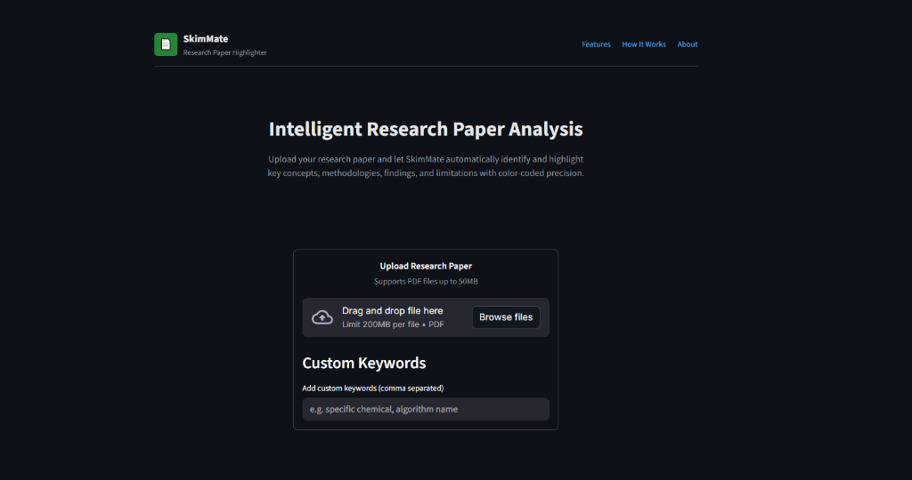

# SkimMate 📄

[](https://skimmate.streamlit.app/)

**SkimMate** is an intelligent research paper analysis tool designed to help researchers and students rapidly assess scientific papers. By automatically highlighting key concepts like **Methodology**, **Novelty**, and **Errors**, it allows for efficient skimming and quick insight extraction.




## 🚀 Features

-   **Smart Keyword Analysis**: Automatically categorizes content into Errors, Novelty, Methodology, and Results.
-   **Visual Dashboard**:
    -   **Keyword Stats**: Instant frequency counts of key terms.
    -   **Extracted Sentences Preview**: Scrollable list of findings with **context-aware highlighting**.
-   **PDF Highlighting**: Generates and downloads a color-coded version of your PDF.
-   **Dark Mode UI**: A clean, modern interface built with Streamlit.

## 🛠️ Installation

1.  **Clone the repository**:
    ```bash
    git clone https://github.com/Plasmaa/SkimMate.git
    cd SkimMate
    ```

2.  **Set up a Virtual Environment** (Recommended):
    ```bash
    python -m venv .venv
    # Windows
    .venv\Scripts\activate
    # Mac/Linux
    source .venv/bin/activate
    ```

3.  **Install Dependencies**:
    ```bash
    pip install -r requirements.txt
    ```

## 🏃‍♂️ Usage

Run the application locally:

```bash
streamlit run app.py
```

Open your browser to `http://localhost:8501`, upload a PDF, and start analyzing!

## 📂 Project Structure

-   `app.py`: Main application logic and UI.
-   `processor.py`: PDF text extraction and highlighting logic.
-   `utils.py`: Configuration for keywords and colors.
-   `PROJECT_DOCUMENTATION.md`: Detailed documentation.

---
*Built with Python, Streamlit, and PyMuPDF.*
